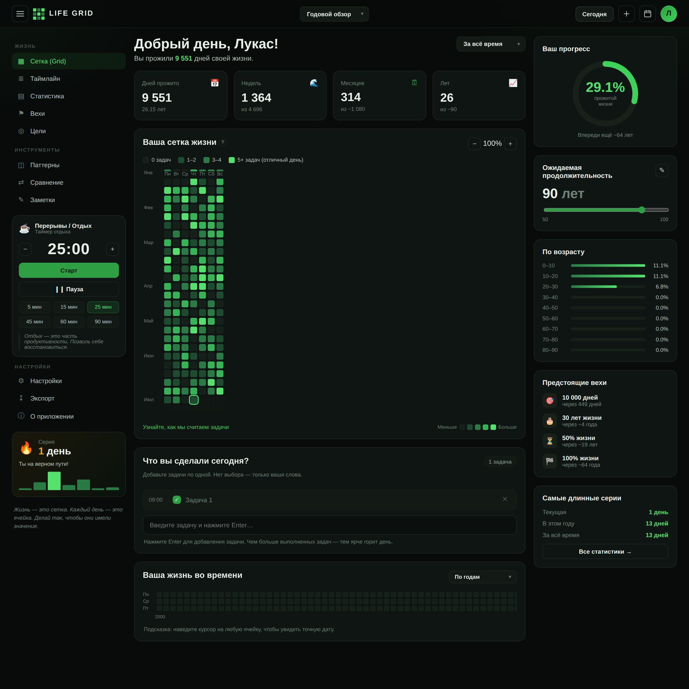

# LIFE GRID

Дашборд-карта вашей жизни в стиле GitHub-контрибьюшнов. Главная сетка жизни течёт **сверху вниз**: время идёт вниз по строкам. Отмечайте, что делали в каждый день — чем больше выполненных задач, тем ярче горит день (и вся неделя).



## Что внутри

Полноценный трёхколоночный дашборд:

**Левая панель**
- Навигация: Сетка, Таймлайн, Статистика, Вехи, Цели, Паттерны, Сравнение, Заметки
- **Таймер отдыха** (Pomodoro) с пресетами 5/15/25/45/60/90 мин, старт/пауза
- Карточка серии (streak) с мини-графиком последних 7 дней
- Настройки, экспорт, о приложении

**Центр**
- Приветствие по времени суток + число прожитых дней
- 4 карточки статистики: дни, недели, месяцы, годы
- **Сетка жизни** — GitHub-heatmap, флоу **сверху вниз**:
  - *Годовой обзор* — недели идут вниз, дни недели (Пн–Вс) по колонкам, месяцы слева
  - *Вся жизнь* — классическая «life in weeks»: годы по строкам вниз, недели по колонкам
  - Клик по ячейке → редактор задач выбранного дня, live-подсветка
- «Что вы сделали сегодня?» — список задач с временем, галочками, удалением
- «Ваша жизнь во времени» — сжатый heatmap всей жизни

**Правая панель**
- Кольцевой прогресс «% прожитой жизни»
- Ползунок ожидаемой продолжительности жизни
- Разбивка «По возрасту» (доля жизни по десятилетиям)
- «Предстоящие вехи»: 10 000 дней, 30 лет, 50%, 100% жизни
- «Самые длинные серии»: текущая / за год / за всё время

## Как считается яркость

| Уровень | День (выполнено задач) | Неделя (сумма за 7 дней) |
| ------- | ---------------------- | ------------------------ |
| 0       | 0                      | 0                        |
| 1       | 1–2                    | 1–4                      |
| 2       | 3–4                    | 5–9                      |
| 3       | 5–6                    | 10–16                    |
| 4       | 7+                     | 17+                      |

## Запуск

Статический сайт без сборки и бэкенда:

```bash
npx http-server . -p 8080     # затем http://localhost:8080
```

или просто откройте `index.html` в браузере. При первом запуске укажите **дату рождения** — сетка привяжется к вашей реальной жизни.

## Хранение данных

Всё хранится локально в `localStorage` этого браузера. Есть экспорт/импорт JSON. Ничего не отправляется на сервер.

## Стек

Чистые HTML + CSS + JavaScript, без зависимостей.

- `index.html` — разметка дашборда
- `styles.css` — тёмная тема в стиле GitHub
- `app.js` — сетка, задачи, статистика, таймер, серии, хранение
